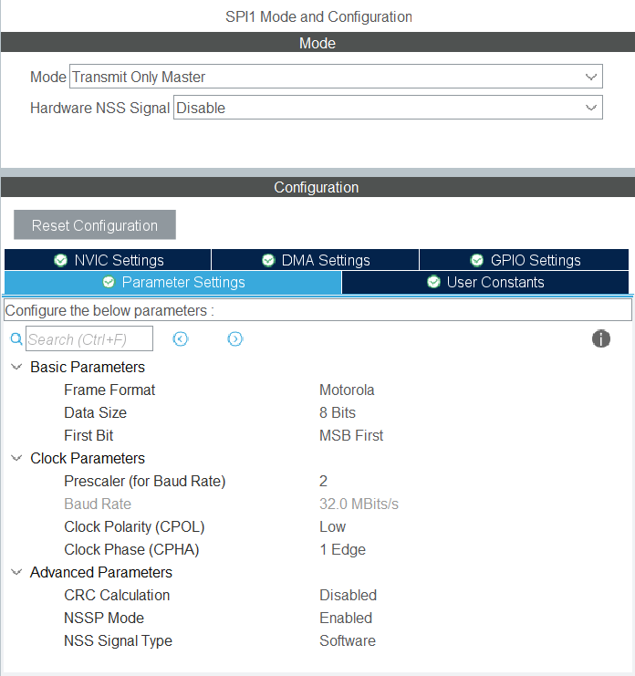

# STM32G0B1RE_TOUCHGFX

## Başlangıç
Öncelikle STM32CubeIDE üzerinden proje açılır.
Kullanılacak TFT ekranın çalışabilmesi için gerekli olan SPI ayarının STM32CubeMX içerisinde yapılması gerekir.
Burada Transmit Only Master modu seçilir. Baud Rate 32 MBits/s olarak seçilir.

  

 
c