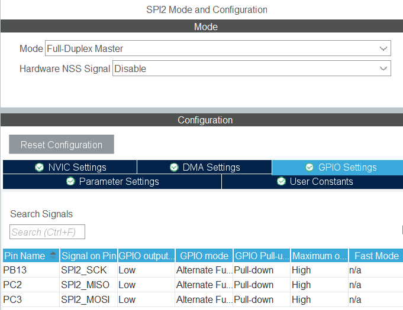

# STM32G0B1RE_TOUCHGFX

## Başlangıç
Öncelikle STM32CubeIDE üzerinden proje açılır.
Kullanılacak TFT ekranın çalışabilmesi için gerekli olan SPI ayarının STM32CubeMX içerisinde yapılması gerekir.
Burada Transmit Only Master modu seçilir. Baud Rate 32 MBits/s olarak seçilir.

## TFT Ekran STM32CubeMX Konfigürasyonları

  

 

STM32CubeMX içerisinde TFT için kullanılan SPI1'in pin konfigürasyonları yapılmıştır. SPI pinlerinin Pull-down olarak seçilmesi gerekmektedir. Ayrıca maksimum çıkış hızı High seçilmiştir. 

TFT için 
DISPLAY_CSX   -> PB5   
DISPLAY_DCX   -> PB3 
DISPLAY_TE    -> PA0 -> External Interrupt olarak ayarlanmıştır. 
DISPLAY_RESET -> PA1 olarak seçilmiştir. 

  

 

SPI kullanırken DMA kullandığımız için DMA ayarı yapılır. STM32 mikrodenetleyici kartından TFT'ye doğru tek taraflı iletim olduğu için sadece SPI1_TX için DMA kullanılır. Ayrıca burada Data Width seçeneğinin Half Word olarak seçilmesi gerekmektedir.

  

 

## Nor Flash STM32CubeMX Konfigürasyonları

External Flash birimine ulaşmak için SPI2 kullanılmıştır. Baud Rate olarak 32 MBits/s seçilmiştir.

  

 

SPI2 için GPIO konfigürasyonları yapılmıştır. SPI için kullanılan SCK, MISO, MOSI pinlerinin dirençleri Pull-down olarak ayarlanmıştır. 
Nor Flash için  
FLASH_CS -> PB9 seçilmiştir. 

  

 

## CPT STM32CubeMX Konfigürasyonu

Kullanılan dokunmatik ekran için I2C2 kullanılmıştır. Hız olarak 400 Khz kullanılmıştır.

  

 

CPT için pin konfigürasyonları yapılmıştır.
CPT_INT   -> PB7 External Interrupt olarak ayarlanmıştır.
CPT_RESET -> PA15 olarak ayarlanmıştır.
I2C için SDA ve SCL pinleri Pull-up olarak seçilmiştir.

  

 

## TouchGFX 

Öncelikle X-CUBE-TOUCHGFX yazılım paketinin STM32CubeMX içerisinde yüklenmesi gerekir. 
Bunun için Help -> Manage embedded software packages -> STMicroelectronics kısmına girilir ve gerekli sürüm yüklenir.

  

 

Paket yüklendikten sonra Middleware and Software Packs altında X-CUBE-TOUCHGFX'e tıklanır ve Graphics Application tiklenir. 
Ardından şekildeki gibi Please Enable CRC IP uyarısını gidermek için Computing -> CRC kısmından aktif hale getirilir.

  

 

TouchGFX Generator ayarları yapılır.

  

 
