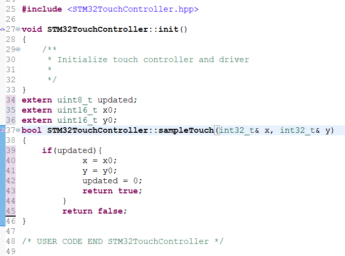

# STM32CubeIDE Kısmında Yapılacaklar


Öncelikle kütüphanelerin ve driver dosyalarının koda eklenmesi gereklidir.


<div align="center">
  
</div>
<br />
Dosyaları STM32CubeIDE -> Core -> Inc içerisine atılır.
<br />
<br />
<div align="center">
  
</div>
<br />
Dosyaları STM32CubeIDE -> Core -> Src içerisine atılır.<br />

Ardından stm32g0xx_it.c dosyası içerisinde DMA Callback fonksiyonları içerisinde hazır Callback fonksiyonları yorum satırı haline getirilip MB1642 fonksiyonları kullanılır.
<br />
<div align="center">
  
</div>
<br />

Ardından Proje dosyaları içerisinde TouchGFX->target içerisinde STM32TouchController.cpp dosyası içerisine ekleme yapılır.
<br />
<div align="center">
  
</div>
<br />

TouchGFX->target içerisinde TouchGFXHal.cpp dosyası içerisinde kütüphane eklemeleri ve değişken tanımlamaları yapılır.

<br />
<div align="center">
  
</div>
<br />

TouchGFXHAL::initialize() fonksiyonun içeriği aşağıdaki kod bloğu ile değiştirilir.

```

	    // Calling parent implementation of initialize().
		//
		// To overwrite the generated implementation, omit call to parent function
		// and implemented needed functionality here.
		// Please note, HAL::initialize() must be called to initialize the framework.


		MB1642BDisplayDriver_Init();
		DataReader_Init();

		/* Prepares Display for operation */
		MB1642BDisplayDriver_DisplayReset();
		MB1642BDisplayDriver_DisplayInit();

		/* Initialize TouchGFX Engine */
		TouchGFXGeneratedHAL::initialize();
		setButtonController(&bc);

		/* Wait for first VSync from display */
		touchgfx::OSWrappers::waitForVSync();

		/* Render first frame, so there is valid date in the displays GRAM */
		HAL::getInstance()->backPorchExited();

		/* GRAM has been filled, turn on display to show content of GRAM */
		MB1642BDisplayDriver_DisplayOn();
		touchgfx::OSWrappers::signalRenderingDone();
```

Ardından beginFrame fonksiyonun içi düzenlenir.
```
bool TouchGFXHAL::beginFrame() {
	TE = 0;
	return TouchGFXGeneratedHAL::beginFrame();
}
```

endFrame fonksiyonun içi düzenlenir.
```
void TouchGFXHAL::endFrame() {
	TouchGFXGeneratedHAL::endFrame();
	if (TE > 0) {
		touchgfx::OSWrappers::signalVSync();
	}
}

```
TouchGFX->target içerisinde TouchGFXDataReader.cpp dosyası içerisinde MB1642BDataReader.h kütüphanesinin dahil edilmesi gerekir. 
<br />
<div align="center">
  
</div>
<br />
Ardından main.c dosyası içerisinde touch_driver.h kütüphanesi dahil edilir ve dokunmatik için handle tanımlaması yapılır.<br />

```

/* USER CODE BEGIN PV */
sitronix_handle_t handle = {
		.device_address = SITRONIX_TOUCH_ADDRESS ,
		.i2c_handle = &hi2c2
};
/* USER CODE END PV */

```

Sonrasında MX_TIM2_Init() ile MX_TouchGFX_Init() arasına aşağıdaki kod şekildeki gibi eklenir.
``` 
	sitronix_hardware_reset();
	HAL_Delay(300);
	sitronix_version_get(&handle);
	sitronix_status_get(&handle);
	sitronix_close_multitouch(&handle);
```

<br />
<div align="center">
  
</div>
<br />

SPI Flashın STM32G0B1RETX_FLASH.ld dosyasının içerisinde MEMORY kısmına SPI Flashın eklenmesi gereklidir.


<br />
<div align="center">
  
</div>
<br />

Ardından STM32G0B1RETX_FLASH.ld dosyasının sonuna aşağıdaki bölüm eklenir.

<br />
<div align="center">
  
</div>
<br />

Son olarak External Loader dosyasının yüklenmesi de aşağıdaki gibi proje dosyasına sağ tıklayarak Debug As-> Debug Configurations seçeneğine tıklanır.
<br />
Debugger sekmesinden External loaders kısmından External Dosyası seçilir.

<br />
<div align="center">
  
</div>
<br />

Artık ekranın sürülmesi için herhangi bir sorun kalmamıştır. Bundan sonraki kısımda TouchGFX-> Dosya_İsmi.touchgfx dosyası ile TouchGFX Designer programında tasarım yapıp STM32CubeIDE kısmından mikrodenetleyiciye yükleyerek arayüz tasarımı yapabilirsiniz.